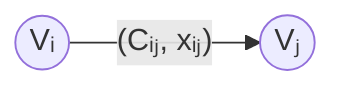

## 10.1 定义

### 10.1.1 流量图

设有向图$D=(V,A,C)$，$V$是点的集合，$A$是边的集合，$C$是容量的集合。

通过弧$(V_i,V_j)$的流的数量称为流量，记作$x_{ij}$。$C_{ij}(\ge 0)$称为容量（流量的上限）。
所有弧上流量的集合$\{ x_{ij} \}$称为网络$D$的一个流。



其中，发点$V_s$是仅有出度的点，入点$V_t$是仅有入度的点，中间点是$V\setminus 发点与入点$。

标注了流量与容量的图称为流量图。

### 10.1.2 可行流

满足以下条件的是可行流：
1. 容量条件：$0\le x_{ij} \le C_{ij}$
2. 平衡条件：发点的净输出量 = 收点的净输入量，中间点的输入量 = 中间点的输出量。
是研究问题的前提。

### 10.1.2 增广链

增广链又称增流链，是一条从源点到汇点、且每条弧剩余容量均大于0的路径。沿该路径可以整体增加流量，因此称为增广链。

可以通过$(节点，边，节点)$的方法表示一条链。例如上图的$(V_i,(V_i,V_j),V_j)$。注意边的方向要和实际有向图方向一样。

若$(V_i,V_j)$的方向也是$V_s$到$V_t$的方向，称为前向弧，反之称为反向弧。

如何寻找增广链？前向弧流量越大越好，反向弧流量越小越好。计算是否为增广链时，类似于$KCL$，节点净出入流量守恒作为约束。

### 10.1.3 最大流

最大流是满足所有约束且总流量最大的可行流。

所有弧上流量的集合$\{ x_{ij} \}$称为网络$D$的一个流：当对于此时的$\{x_{ij}\}$，没有增广链时，称此时的$\{ x_{ij}\}$为最大流。即没有增广链⇔已经达到最大流。

## 10.2 求解

如何求最大流？$Ford Fulkerson$算法：

标号：若有弧$(V_i,V_j)$，那么给$V_j$标号$(+/-V_i,\Delta_j)$，+-分别指示前向弧/反向弧。
前向弧：$\Delta_j=\min\{ C_{ij}-x_{ij}, \Delta_i \}$表示$j$节点当前链条能优化的最大增量（木桶效应取最小值）
负向弧：$\Delta_j=\min\{ x_{ij}, \Delta_i \}$ （负向弧要考虑减少的最大量）
特殊的，出发点为$(0,+\infty)$。

每一次循环：
- 寻找是否有可以优化的弧：$x_{ij}<C_{ij}$，若有，计算$\Delta_j$并进入下一个节点。
- 若没有可以优化的弧，且当前点不是$V_t$，说明没有增广链了，此时的流是最大流。
- 若到达了$V_t$，说明找到了增广链，取所有$\Delta_i$的最小值，作为在当前链条上每一正向弧增量，负向弧减少量。
$continue...$

**导入**：
```python
from scipy.sparse import csr_matrix
from scipy.sparse.csgraph import maximum_flow
```

**函数原型**：
```python
scipy.sparse.csgraph.maximum_flow(
    csgraph,
    source,
    sink,
    *,
    method='dinic'
)
```

| 参数        | 类型            | 说明                          |
| --------- | ------------- | --------------------------- |
| `csgraph` | sparse matrix | 网络容量矩阵，必须要用`csr_matrix()`转换 |
| `source`  | int           | 源点编号                        |
| `sink`    | int           | 汇点编号                        |
| `method`  | {'dinic'}     | 求解算法，目前仅支持 Dinic 算法         |

**返回值**：
返回一个 `MaximumFlowResult` 对象。

|属性|类型|说明|
|---|---|---|
|`flow_value`|int|最大流值。|
|`flow`|ndarray|与容量矩阵同维度的流量矩阵，第 `(i,j)` 个元素表示边 $(i,j)$ 的实际流量。|
**注意**：
- 节点编号从 **0** 开始。
- 容量矩阵中的元素必须为**非负整数**，负容量是不允许的。