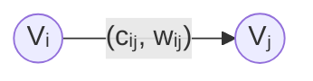

## 10.1 定义

每条路线最大允许的容量和通过该弧的费用分别为$c_{ij}与w_{ij}$。



则可行流的费用为$\sum_{(v_i, v_j)\in A}w_{ij}x_{ij}$。$A$为弧集，$x_{ij}$为实际流量。

## 10.2 求解

最小费用：将费用作为边权，求$V_s$到$V_t$最短路径。

对于每一条弧，存在两种基本操作：**增加流量**和**减少流量**。增加流量对应于沿原始弧增广，减少流量对应于沿反向弧增广。
当$x_{ij}=0$ 时，仅允许增加流量，因此只有正向弧存在；
当 $x_{ij}=w_{ij}$ 时，仅允许减少流量，因此只有反向弧存在；
其余情况下，正向弧与反向弧同时存在。

每一次循环：
- 在当前残量网络中寻找源点到汇点的最小费用增广链条
- 计算该最短路上的最大增量并应用
- 根据增加后的流量，修改每一个弧，使得满足上述条件
- 找不到增广链时，取得最大流
$continue...$

**导入**：
```python
import networkx as nx
```

**函数原型**：
```python
networkx.max_flow_min_cost(G, s, t, capacity='capacity', weight='weight')
```

| 参数         | 类型               | 说明                     |
| ---------- | ---------------- | ---------------------- |
| `G`        | `NetworkX graph` | 有向图 (`DiGraph`)        |
| `s`        | Node             | 源点                     |
| `t`        | Node             | 汇点                     |
| `capacity` | str              | 容量属性名称，默认 `"capacity"` |
| `weight`   | str              | 单位费用属性名称，默认 `"weight"` |
其中，`NetworkX graph` 这样创建：
```python
G = nx.DiGraph()
G.add_edge(
    u,
    v,
    capacity=10,
    weight=5
)
```

**返回值**：
字典，`res[i][j]`表示`i`到`j`实际流量

**总费用**：
```python
nx.cost_of_flow(G, res)
```
