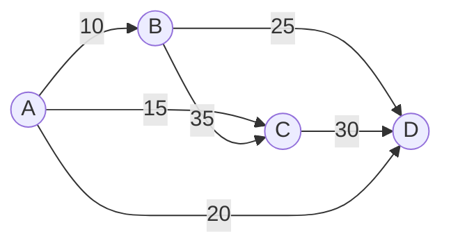

## 12.1 定义

旅行商问题：给定一系列城市和每对城市之间的距离，求解**访问每座城市恰好一次并返回起始城市**的最短回路。



该回路称为 **Hamilton 回路**（遍历所有顶点且不重复的回路）。

## 12.2 求解

### 12.2.1 01整数规划

设决策变量为$x_{ij}$，含义为：$\begin{cases} 1,从i点到j点在最短路上 \\ 0,从i点到j点不在最短路上\end{cases}$。
目标函数为$\min \sum_{(i,j) \in V}w_{ij}x_{ij}$。

$$
s.t. 
\begin{cases} 
出度=1\\ \\
入度=1 \\ \\
- \\ \\
能够跑到所有点，边数=点数
\end{cases}

\Rightarrow

\begin{cases}
\sum_j^nx_{ij}=1 \\ \\ 
\sum_i^nx_{ij}=1 \\ \\ 
x_{ij} \in \{0,1\} \\ \\
\sum_{ij\in V}x_{ij}=|V|
\end{cases}
$$

### 12.2.2 改良圈算法

一种启发式算法，通过不断"断开—重连"来优化初始回路。

给定初始 Hamilton 圈 $C = v_1v_2\cdots v_nv_1$，对于任意 $1 < i+1 < j < n$，检查能否通过删除边 $(v_i, v_{i+1})$ 和 $(v_j, v_{j+1})$ 并添加边 $(v_i, v_j)$ 和 $(v_{i+1}, v_{j+1})$ 来缩短总路程。

若满足：

$$
w(v_i, v_j) + w(v_{i+1}, v_{j+1}) < w(v_i, v_{i+1}) + w(v_j, v_{j+1})
$$

则将 $C$ 中 $v_{i+1}$ 到 $v_j$ 这一段**逆序**，得到新回路 $C'$，路长缩短。

**步骤**：
1. 任取一个初始 Hamilton 圈 $C_0$（如按顶点编号顺序）
2. 对 $i = 1, 2, \dots, n-2$，$j = i+1, \dots, n-1$ 遍历，满足条件则反转 $v_{i+1} \sim v_j$ 段
3. 一轮结束后若未发生任何交换，算法终止；否则回到第 2 步

**Python 实现**：

**函数原型**：
```python
improve_circle(dist)
```

| 参数 | 类型 | 说明 |
| --- | --- | --- |
| `dist` | `np.ndarray` | n×n 距离矩阵，`dist[i][j]` 为城市 i 到 j 的距离 |

**返回值**：`(route, cost)`

| 返回值 | 类型 | 说明 |
| --- | --- | --- |
| `route` | `list` | 最优回路，顶点顺序列表（不含结尾重复的起点） |
| `cost` | `float` | 回路总距离 |

```python
import numpy as np

def improve_circle(dist):
    n = len(dist)
    route = list(range(n)) + [0]
    improved = True

    while improved:
        improved = False
        for i in range(n - 2):
            for j in range(i + 2, n):
                delta = (dist[route[i]][route[j]] +
                         dist[route[i+1]][route[(j+1) % n]] -
                         dist[route[i]][route[i+1]] -
                         dist[route[j]][route[(j+1) % n]])
                if delta < -1e-9:
                    route[i+1:j+1] = reversed(route[i+1:j+1])
                    improved = True

    cost = sum(dist[route[k]][route[k+1]] for k in range(n))
    return route[:-1], cost
```
