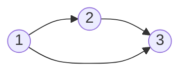
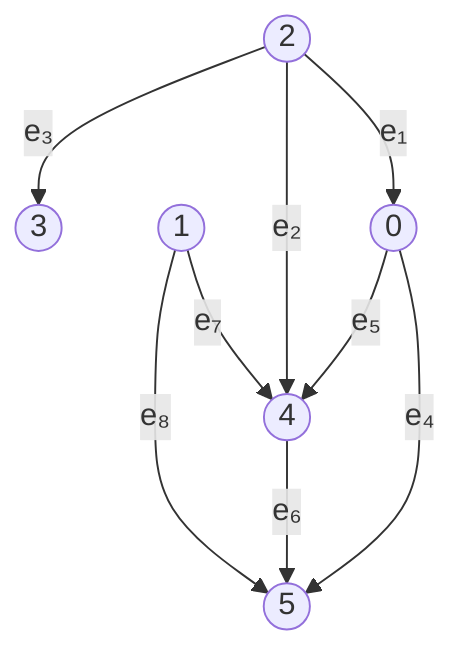

## 8.1图的定义

对于平面上的若干点, 把这些点用曲线或直线连接起来,不考虑点的位置与连线的曲直长短,这样形成的关系结构就是图。

## 8.2 图的分类
图又分为有向图和无向图。

## 8.3 图的表示方法
### 8.3.1 数学方法

一个图可以用数学语言表述为$G(V(G),E(g))$，$V(vector)$代表图的定点集合，$E(edge)$代表图的边集。

下面是一个有向图的直观例子，含 6 个顶点（$0-5$）与 8 条有向边（$e_1-e_8$）：

顶点集与边集可记为：

- 顶点集 $V = \{0, 1, 2, 3, 4, 5\}$
- 边集 $E = \{e_1, e_2, e_3, e_4, e_5, e_6, e_7, e_8\}$

### 8.3.2 计算机方法

1. 邻接矩阵

若图有`m`个点，对于二维数组`array[m][m]`，`array[i][j]`存储从`i`到`j`的边权`w`。
若未相连`np.inf`表示，`array[i][i]`用`0`表示。

若是无向图，其邻接矩阵是对称矩阵，`array[i][j]==array[j][i]`。