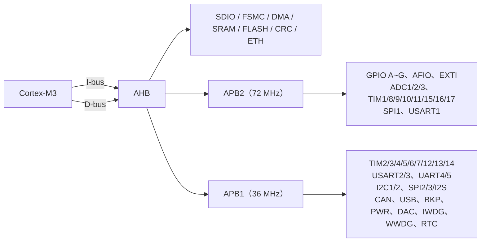
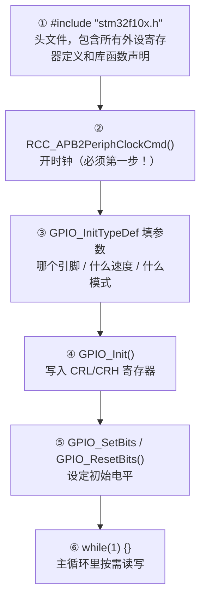

# STM32 GPIO 工作模式

STM32F1 的 GPIO 共有 **8 种工作模式**，由 `GPIOx_CRL` / `GPIOx_CRH` 寄存器的 `CNF` 和 `MODE` 位配置：

## 一、输入模式（4 种）

| 模式 | 库常量 | 说明 |
|------|------|------|
| 模拟输入 | `GPIO_Mode_AIN` | ADC 输入、DAC 输出，禁用施密特触发器，TTL 电平，几乎零功耗 |
| 浮空输入 | `GPIO_Mode_IN_FLOATING` | 复位后默认。IO 电平完全由外部决定，引脚悬空时电平不确定 |
| 上拉输入 | `GPIO_Mode_IPU` | 内部弱上拉（~40kΩ），引脚悬空时读为高电平 |
| 下拉输入 | `GPIO_Mode_IPD` | 内部弱下拉（~40kΩ），引脚悬空时读为低电平 |

> **注意**：STM32F1 的上拉/下拉通过 `GPIOx_ODR` 寄存器区分（`CNF=10` 时，`ODR=1` 为上拉，`ODR=0` 为下拉）。`GPIO_Mode_IPU = 0x48`、`GPIO_Mode_IPD = 0x28`，库已经帮你把 ODR 位塞进去了。F4 及以后系列才用独立的 `PUPDR` 寄存器。

## 二、输出模式（4 种）

| 模式 | 库常量 | 说明 |
|------|------|------|
| 通用推挽输出 | `GPIO_Mode_Out_PP` | 输出高低电平，驱动能力强，最常用 |
| 通用开漏输出 | `GPIO_Mode_Out_OD` | 只能输出低电平/高阻态，高电平靠外部上拉，适用于 I²C、电平转换 |
| 复用推挽输出 | `GPIO_Mode_AF_PP` | 外设（USART、SPI、TIM 等）控制输出，推挽方式 |
| 复用开漏输出 | `GPIO_Mode_AF_OD` | 外设控制输出，开漏方式，典型应用 I²C |

## 三、输出速度（MODE 位）

`CNF` + `MODE` 共同占用每 Pin 4 个配置位（CRL 管 0~7，CRH 管 8~15）。`MODE` 两位控制输出驱动的**翻转速率（slew rate）**——速度越快，驱动管开启越猛，边沿越陡。

| 库常量 | 最大翻转速度 | 说明 |
|------|-------------|------|
| （输入模式无速度） | — | 输入模式，输出驱动被禁用 |
| `GPIO_Speed_10MHz` | 10 MHz | 高速率，用于高速外设（SPI、SDIO）或需要陡峭边沿的场景 |
| `GPIO_Speed_2MHz` | 2 MHz | 中等速率，通用外设首选（USART、普通 IO 翻转） |
| `GPIO_Speed_50MHz` | 50 MHz | 最高速率，片上最高翻转能力，用于 FMC/高速总线 |

一般直接选 `GPIO_Speed_50MHz` 就行。

## 四、GPIO 在硬件中的位置




### RCC 时钟门控

GPIO 虽挂在 APB2 上，但**复位后所有 GPIO 时钟默认关闭**（省电）。要操作任何 GPIO 寄存器，必须先通过 RCC 打开对应端口的时钟门：

调用方式：
```c
RCC_APB2PeriphClockCmd(RCC_APB2Periph_GPIOA, ENABLE);  // 打开 GPIOA 时钟
```
底层就是把 `RCC->APB2ENR` 对应位置 1，这在 `stm32f10x_rcc.c` 的 `RCC_APB2PeriphClockCmd()` 里实现。

## 五、GPIO 初始化——写代码的顺序

不管你要做什么功能，`main()` 里 GPIO 相关的代码按这个顺序写就行：

### 步骤总览



### 完整例子：点亮 PC13 的 LED

STM32F1 最小系统板（如 Blue Pill、C8T6）的板载 LED 通常在 **PC13**。下面是一个能直接用的完整 `main.c`：

```c
#include "stm32f10x.h"                  // ① 唯一的头文件

int main() {
    // ② 开 GPIOC 时钟（GPIO 挂在 APB2，不先开时钟寄存器写不进去）
    RCC_APB2PeriphClockCmd(RCC_APB2Periph_GPIOC, ENABLE);

    // ③ 填结构体
    GPIO_InitTypeDef GPIO_InitStr;
    GPIO_InitStr.GPIO_Pin   = GPIO_Pin_13;       // 选 PC13
    GPIO_InitStr.GPIO_Speed = GPIO_Speed_50MHz;   // 输出速度
    GPIO_InitStr.GPIO_Mode  = GPIO_Mode_Out_PP;   // 推挽输出

    // ④ 写入硬件寄存器
    GPIO_Init(GPIOC, &GPIO_InitStr);

    // ⑤ 设初始电平：PC13 通常低电平点亮
    GPIO_ResetBits(GPIOC, GPIO_Pin_13);

    // ⑥ 死循环（裸机程序不能 return，跑了就没了）
    while (1) {}
}
```

### 每一步在干什么

| 步骤 | 代码 | 如果不写会怎样 |
|------|------|--------------|
| 开时钟 | `RCC_APB2PeriphClockCmd(RCC_APB2Periph_GPIOC, ENABLE)` | **HardFault**。AHB-APB 桥上 GPIOC 的时钟门关着，寄存器读写被拒绝 |
| 填 Pin | `.GPIO_Pin = GPIO_Pin_13` | 配了空气，没有引脚被配置 |
| 填 Speed | `.GPIO_Speed = GPIO_Speed_50MHz` | 库会检查参数合法性，参数错了可能卡在 assert |
| 填 Mode | `.GPIO_Mode = GPIO_Mode_Out_PP` | 同上。且模式错了硬件行为完全不对：开漏忘了上拉 = 引脚永远浮空 |
| `GPIO_Init()` | 把结构体翻译成寄存器值写进 CRL/CRH | 什么都没配，引脚保持复位默认（浮空输入） |
| 设初始电平 | `GPIO_ResetBits()` / `GPIO_SetBits()` | 输出电平不确定，LED 可能乱闪甚至烧 IO |

### 不同场景的配置组合

```c
// LED / 继电器 / 蜂鸣器 输出
GPIO_InitStr.GPIO_Mode = GPIO_Mode_Out_PP;

// I²C 数据线 / 电平转换（需要外部上拉）
GPIO_InitStr.GPIO_Mode = GPIO_Mode_Out_OD;

// 按键 / 信号读取
GPIO_InitStr.GPIO_Mode = GPIO_Mode_IPU;   // 内部上拉，按键另一端接地，按下读到 0

// ADC 模拟量读取
GPIO_InitStr.GPIO_Mode = GPIO_Mode_AIN;    // 模拟模式，关闭数字输入，省电

// 串口 TX / SPI / PWM 等复用功能
GPIO_InitStr.GPIO_Mode = GPIO_Mode_AF_PP;  // 复用推挽
```