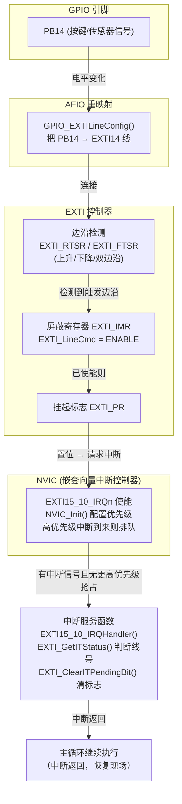

# 2 EXIT — 外部中断（EXTI）实验

基于 STM32F103（标准外设库），外部中断按键计数，OLED 显示。

## STM32 中断结构图



### 关键点

- **每个 EXTI 线只能接一个引脚**: PB14 用了 EXTI14 线, 其他引脚就不能再用 EXTI14 了。
- **多条 EXTI 线共用同一中断向量**: EXTI5~9 → EXTI9_5_IRQn, EXTI10~15 → EXTI15_10_IRQn。共用向量时, 中断函数里要用 `EXTI_GetITStatus()` 判断是哪个线触发的。
- **中断函数里一定要清标志**: 不清 `EXTI_PR` 会反复进入中断, 主循环卡死。
- **退出中断前 NVIC 会自动清中断标志位**, 但 EXTI 的挂起标志要自己用 `EXTI_ClearITPendingBit()` 清。

## 配置 EXTI 中断一般过程

以本实验的 CountSensor 为例:

### 1. 开启 GPIO 时钟, 配置引脚为输入模式

```c
RCC_APB2PeriphClockCmd(RCC_APB2Periph_GPIOB, ENABLE);
GPIO_InitTypeDef GPIO_InitStruct;
GPIO_InitStruct.GPIO_Mode = GPIO_Mode_IPU;      // 上拉输入
GPIO_InitStruct.GPIO_Pin  = GPIO_Pin_14;
GPIO_InitStruct.GPIO_Speed = GPIO_Speed_50MHz;
GPIO_Init(GPIOB, &GPIO_InitStruct);
```

### 2. 开启 AFIO 时钟, 把引脚映射到 EXTI 线

```c
RCC_APB2PeriphClockCmd(RCC_APB2Periph_AFIO, ENABLE);      // 必须先开, 否则映射无效
GPIO_EXTILineConfig(GPIO_PortSourceGPIOB, GPIO_PinSource14); // PB14 → EXTI14
```

### 3. 配置 EXTI 触发方式和中断使能

```c
EXTI_InitTypeDef EXTI_InitStruct;
EXTI_InitStruct.EXTI_Line    = EXTI_Line14;
EXTI_InitStruct.EXTI_Mode    = EXTI_Mode_Interrupt;        // 中断模式 (还有 EXTI_Mode_Event 事件模式)
EXTI_InitStruct.EXTI_Trigger = EXTI_Trigger_Falling;       // 下降沿触发 (按键按下)
EXTI_InitStruct.EXTI_LineCmd = ENABLE;
EXTI_Init(&EXTI_InitStruct);
```

### 4. 配置 NVIC

```c
NVIC_PriorityGroupConfig(NVIC_PriorityGroup_2);            // 设置分组 (main 里配置一次即可)
NVIC_InitTypeDef NVIC_InitStruct;
NVIC_InitStruct.NVIC_IRQChannel                   = EXTI15_10_IRQn;
NVIC_InitStruct.NVIC_IRQChannelPreemptionPriority = 1;     // 抢占优先级
NVIC_InitStruct.NVIC_IRQChannelSubPriority        = 1;     // 响应优先级
NVIC_InitStruct.NVIC_IRQChannelCmd                = ENABLE;
NVIC_Init(&NVIC_InitStruct);
```

### 5. 编写中断服务函数 (stm32f10x_it.c)

```c
void EXTI15_10_IRQHandler(void) {
    if (EXTI_GetITStatus(EXTI_Line14) != RESET) {           // 判断是哪个线 (共用向量时必要)
        // 处理业务: 计数 +1 等
        EXTI_ClearITPendingBit(EXTI_Line14);                // 清除挂起标志, 必须!
    }
}
```

中断函数名必须和启动文件 `startup_stm32f10x_xl.s` 里向量表的名字完全一致, 这样向量表才能指向你的函数。
