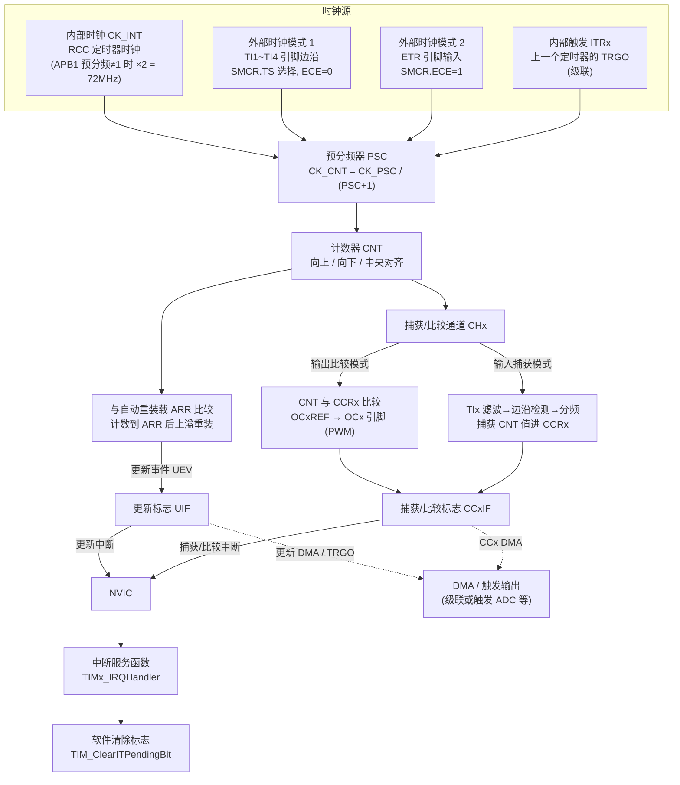

# 3 TIM — 定时器（TIM）实验

基于 STM32F103（标准外设库），通用定时器 TIM 定时 / 输入捕获 / 外部时钟计数。

## STM32 定时器结构图



> 说明: 图里 `.->` 虚线表示 DMA/触发等"事件"路径, 实线 `-->` 表示"中断"路径。
> 更新事件 UEV 和捕获/比较事件, 既能走 DMA / TRGO 触发, 也能走中断进 NVIC。

### 时钟源三条路

- **内部时钟 CK_INT**: 最常用, RCC 开完时钟直接用, 定时器自己数时钟周期。
- **外部时钟模式 1**: 用 TIx 引脚边沿计数 (可配极性/分频), 适合测外部脉冲个数。
- **外部时钟模式 2**: 用 ETR 引脚计数, 适合高频率外部信号。
- **内部触发 ITRx**: 前级定时器的 TRGO 当本定时器的时钟, 用于定时器级联。

### 中断两条线

- **更新中断**: 计数器溢出 (CNT 到 ARR 重装) → UEV → UIF → 中断。定时用的就是它。
- **捕获/比较中断**: 输入捕获 (TIx 边沿把 CNT 存进 CCRx) 或输出比较 (CNT 到 CCRx 触发输出) → CCxIF → 中断。

## 关键点

- **APB1 上定时器的时钟**: 系统时钟 72MHz 时 APB1 分频为 /2, 但定时器时钟要 ×2, 所以 TIM2~5 仍是 72MHz; APB2 上的 TIM1/8 就是 APB2 时钟 72MHz。
- **分频公式**: `CK_CNT = 定时器时钟 / (PSC+1)`, 向上计数时溢出周期 `T = (ARR+1) / CK_CNT`。
- **更新事件 ≠ 更新中断**: 更新事件还能触发 ADC 或走 DMA, 不一定要开中断; 开了中断就要清 `UIF`。
- **捕获/比较标志清除**: 读 `CCRx` 寄存器会自动清 `CCxIF` (输入捕获); 输出比较中断要手动 `TIM_ClearITPendingBit()`。
- **外部时钟模式 1 和 2 的区别**: 模式 1 走 SMCR 的 TS 位选 TIx (还能配合输入捕获), 模式 2 直接由 ECE 位使能 ETR 引脚, 两者由 `TIM_SelectInputTrigger()` / `TIM_ETRClockMode2Config()` 配置。
- **中断函数名必须和启动文件向量表一致**: TIM2~4 各自只有一个向量 `TIM2_IRQHandler` 等 (内部用 `TIM_GetITStatus` 区分更新/捕获); TIM1/8 的更新和捕获是分开的向量 (`TIM1_UP_IRQHandler`、`TIM1_CC_IRQHandler`)。

## 配置 TIM 一般过程

以 TIM2 为例 (时基定时 + 输入捕获, 对应本实验的 System/TIM.c):

### 1. 开启定时器时钟

```c
RCC_APB1PeriphClockCmd(RCC_APB1Periph_TIM2, ENABLE);   // TIM2~5 在 APB1; TIM1/8 用 RCC_APB2PeriphClockCmd
```

### 2. 配置时基单元 (PSC + ARR)

```c
TIM_TimeBaseInitTypeDef TIM_TimeBaseStruct;
TIM_TimeBaseStruct.TIM_Period        = 1000 - 1;       // ARR: 计到 1000 溢出
TIM_TimeBaseStruct.TIM_Prescaler     = 72 - 1;         // PSC: CK_CNT = 72MHz/72 = 1MHz
TIM_TimeBaseStruct.TIM_ClockDivision = TIM_CKD_DIV1;   // 采样分频, 基本用不上
TIM_TimeBaseStruct.TIM_CounterMode   = TIM_CounterMode_Up;
TIM_TimeBaseInit(TIM2, &TIM_TimeBaseStruct);
```

### 3. 配置通道 (输出比较或输入捕获)

```c
TIM_ICInitTypeDef TIM_ICInitStruct;                    // 输入捕获: TI1 边沿把 CNT 存进 CCR1
TIM_ICInitStruct.TIM_Channel     = TIM_Channel_1;
TIM_ICInitStruct.TIM_ICPolarity  = TIM_ICPolarity_Rising;
TIM_ICInitStruct.TIM_ICSelection = TIM_ICSelection_DirectTI;
TIM_ICInitStruct.TIM_ICPrescaler = TIM_ICPSC_DIV1;
TIM_ICInitStruct.TIM_ICFilter    = 0x00;
TIM_ICInit(TIM2, &TIM_ICInitStruct);
// PWM 输出则用 TIM_OCInitTypeDef + TIM_OC1Init()
```

### 4. 使能中断并配置 NVIC

```c
TIM_ITConfig(TIM2, TIM_IT_Update | TIM_IT_CC1, ENABLE);   // 开更新中断和 CC1 捕获中断

NVIC_PriorityGroupConfig(NVIC_PriorityGroup_2);            // main 里配一次即可
NVIC_InitTypeDef NVIC_InitStruct;
NVIC_InitStruct.NVIC_IRQChannel                   = TIM2_IRQn;
NVIC_InitStruct.NVIC_IRQChannelPreemptionPriority = 1;
NVIC_InitStruct.NVIC_IRQChannelSubPriority        = 1;
NVIC_InitStruct.NVIC_IRQChannelCmd                = ENABLE;
NVIC_Init(&NVIC_InitStruct);
```

### 5. 启动定时器

```c
TIM_Cmd(TIM2, ENABLE);   // 别漏, 前面只是配置, 这一步才开始计数
```

### 6. 编写中断服务函数 (stm32f10x_it.c)

```c
void TIM2_IRQHandler(void) {
    if (TIM_GetITStatus(TIM2, TIM_IT_Update) != RESET) {
        // 定时溢出业务
        TIM_ClearITPendingBit(TIM2, TIM_IT_Update);        // 清更新标志, 必须!
    }
    if (TIM_GetITStatus(TIM2, TIM_IT_CC1) != RESET) {
        uint16_t cnt = TIM_GetCapture1(TIM2);              // 读 CCR1 (读操作自动清 CC1IF)
        // 捕获业务: 相邻两次捕获差值 = 周期, 可算频率
    }
}
```
